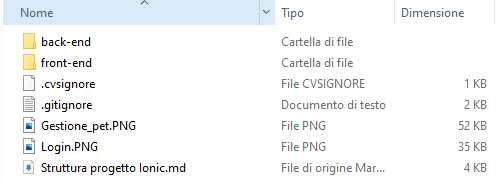
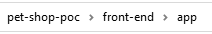
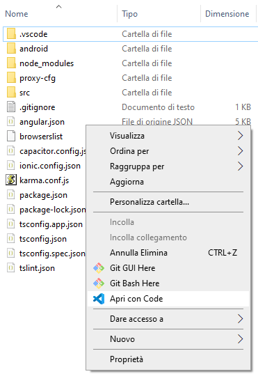
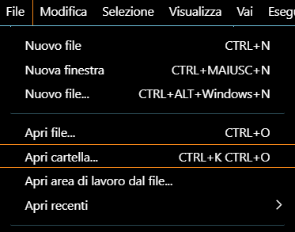
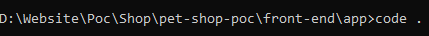
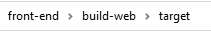
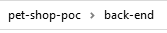

# Quick Start pet shop POC

Questa guida contiene:

* Come reperire i sorgenti del progetto front/back - end.
* Configurazione del front-end.
* Configurazione del back-end.
* Build manuali e automatiche utilizzando Maven.
* Lanciare l'applicazione in locale.

## Prerequisiti

Per completare la quida, avrai bisogno:

* Visual Studio Code
* Avere installata la versione JDK 8+ e aver configurato in modo appropriato la `JAVA_HOME`
* Apache Maven 3.0.4+
* Installare Node dal seguente link [Scarica node](https://nodejs.org/it/download/)
* Installare l'Angular cli
```console
npm install -g @angular/cli@{angular-cli-version}
```

[TIP]
_Verifica che Maven stia utilizzando la versione di Java che ti aspetti
Se hai installato più JDK, non è certo che Maven rilevi la giusta versione di java e potresti ottenere risultati inaspettati.
Puoi verificare quale versione di Maven  stai utilizzando eseguendo_ 

```console
mvn --version
```

## Struttura del progetto e dove scaricarlo

Potete scaricare il progetto dal sequente link [Scarica progetto](https://github.com/Pietrowebsiteitalia96/test-mark-down)

La struttura del progetto una volta scaricato sarà la seguente:

<p style="text-align: center;">
   
</p>

## Front-end


### Struttura del progetto 

Per accedere al front-end dovete andare al seguente path:

<p style="text-align: center;">
   
</p>

Una volta all'interno dovete aprire la cartella con VS code nei seguenti modi:

<p style="text-align: center;">
   
</p>
<em>Figura 1. Primo modo sa file</em>
<br><br>
<p style="text-align: center;">
   
</p>
<em>Figura 2. Secondo modo da VS code</em>
<br><br>
<p style="text-align: center;">
   
</p>
<em>Figura 3. Terzo modo da terminale</em>
<br><br>

la struttura del progetto è spiegata nella guida di link: [Angular](/angular/)

* Dopo l'importazione si deve eseguire il comando :

```console
npm install
```


per scaricare tutte le dipendenze necessarie scritte nel file `package.json`
<br><br>
### Come effettuare la build manuale

Per avviare il progetto basta eseguire il comando: 

```console
ng build
```
e verificare che si crei la cartella www

### Come effettuare la build automatica del web

Per effettuare la build dobbiamo andare nella cartella del front-end che contiene il pom e lanciamo il comando

```console
mvn clean install
```

il pom contiene tutti le istruzzioni che maven deve compiere per poter creare la build, in particolare vengono eseguiti i seguenti passaggi :

1. Cancella il contenuto della cartella www, che contiene tutti i file compressi e compilati dell'ultima build

2. Effettua il comando `npm install` per installare tutte le dipendenze poichè la build automatica potrebbe essere lanciata anche da altri operatori o da altri sistemi (come Jenkins)

3. Effettua la build con delle configurazioni extra che permettono di ottimizzare e migliorare la build.

4. Il risultato è un file zip che può essere deployato e si trova in questa cartella: 

<p style="text-align: center;">
   
</p>

### Come avviare il progetto in locale

Per avviare il progetto basta eseguire il comando: 

```console
ng serve
```

e una volta che le operazioni si sono concluse andare su http://localhost:4200/

## Back-end
Per accedere al back-end dovete andare al seguente path:

<p style="text-align: center;">
   
</p>

### Come avviare il progetto in locale

Per avviare il progetto in locale dovete eseguire il file `start-be-dev.bat`

NOTE: _Vi verrà fatta la domanda se volete fare la build del progetto prima di far partire il back-end, Se è la prima volta dovete effettuare la build, per le volte successive è optionale_
